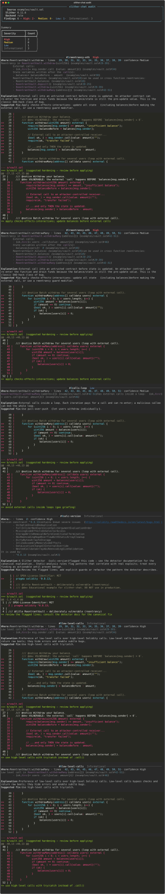

<div align="center">

# 🔍 slither-chat

Your smart-contract **audit copilot** — Slither findings explained in plain English.

[](https://github.com/pxlcrtiv/slither-chat/actions)
[](https://www.python.org/)
[](LICENSE)
[](https://github.com/crytic/slither)
[](https://huggingface.co/Royal-lobster/Slither-Audited-Solidity-QA)
[](https://github.com/astral-sh/ruff)
[](CONTRIBUTING.md)
[](https://github.com/pxlcrtiv/slither-chat/stargazers)
[](https://github.com/pxlcrtiv/slither-chat/forks)
[](https://github.com/pxlcrtiv/slither-chat/commits/main)
[](https://github.com/pxlcrtiv/slither-chat)

</div>

`slither` is world-class at **finding** issues, but its raw output reads like
assembler. Most devs can't triage 40 findings in a weekend audit — so most
audits never get done, and the vulnerabilities never get fixed.

**slither-chat turns a Slither run into a reviewable report**: every finding
gets a plain-English explanation, a suggested fix, a line-precise patch hint,
and severity ordering — and you can score the whole pipeline against real
audited contracts from the Hugging Face Hub.

> ⚠️ **Not a substitute for a professional auditor.** Explanations and patches
> are review *aids*; always verify before deploying.

---

## What it does

- 🔬 Runs Slither (subprocess, JSON mode) and **normalizes** every detector
  finding: rule id, severity, confidence, contract/function, exact lines,
  source snippet.
- 🧠 **Explains every finding** with three interchangeable backends:
  - `rule` — offline knowledge base (zero deps, zero network, works anywhere)
  - `hf` — an on-device **Hugging Face zero-shot model** tags every finding
    with a vulnerability class + confidence (DeBERTa-v3 MNLI on CPU, no API key)
  - `llm` — any OpenAI-compatible API (OpenRouter, HF Inference Endpoints, …)
  - …and degrades gracefully: no key, no model, no network → always works.
- 🩹 Generates **line-precise patch hints** (unified diff) for every finding.
- 📊 **Benchmarks your pipeline against the Hub** — real audited contracts
  with Slither ground truth, scored with precision / recall / F1 per rule.
- 📄 Renders **markdown reports**, rich terminal output, and exportable **SVG**
  (for READMEs), plus full JSON for CI pipelines.

## Tech stack

| Layer | Choice |
|---|---|
| Language | Python ≥ 3.10 (`click` CLI, dataclasses, `httpx`), ruff-linted |
| Static analysis | Slither (`--json` mode via subprocess) + crytic-compile / solc-select |
| ML | Hugging Face `datasets` + `transformers` — DeBERTa-v3 zero-shot tagging, all on-device |
| LLM | Any OpenAI-compatible API (`llm` backend, graceful fallback to `rule`) |
| Reporting | rich (terminal), markdown, SVG export, JSON |
| CI | GitHub Actions — pytest ×2 Python versions, ruff, live benchmark smoke |

## Demo

Live run against `examples/vault.sol` (a deliberately vulnerable reentrancy vault):



<details>
<summary><b>Click for the same run as a markdown report</b></summary>

See [`docs/sample-report.md`](docs/sample-report.md) — a real generated audit
report for the vault example, committed with this repo.

</details>

## Quickstart

```bash
# 1. install (Python ≥ 3.10)
pip install -r requirements.txt          # core: slither, click, rich, hf hub
# optional: pip install transformers torch   → enables --backend hf

# 2. audit a contract — offline, no keys, no network model
slither-chat audit path/to/Contract.sol

# 3. get a markdown report + machine-readable JSON
slither-chat audit Contract.sol --backend rule --markdown report.md --json-out report.json

# 4. explain with a Hugging Face zero-shot model (downloads ~270 MB once)
slither-chat audit Contract.sol --backend hf

# 5. explain with any LLM (fallback: rule backend when not configured)
export LLM_BASE_URL=https://openrouter.ai/api/v1
export LLM_API_KEY=sk-...                                # your key
export LLM_MODEL=meta-llama/llama-3.3-70b-instruct:free  # anything OpenAI-compatible
slither-chat audit Contract.sol --backend llm
```

> `slither` needs a `solc` binary matching the contract's pragma on your PATH.
> `pip install solc-select && solc-select install 0.8.26 && solc-select use 0.8.26`

## Benchmark against real audited contracts (Hugging Face)

The repo ships a `benchmark` command that pulls contracts from an HF dataset
whose rows carry **Slither's own ground truth**, audits them locally, and
scores the pipeline:

```bash
slither-chat benchmark --limit 50
#   corpus: Royal-lobster/Slither-Audited-Solidity-QA (1,748 test contracts)
#   solc versions (solc-select): 0.4.24, 0.4.25, 0.5.16, 0.5.17, 0.6.12, 0.7.6, 0.8.26
#   ┏━━━━━━━━━━━━━━━━━━━━━━━┳━━━━━━━━━┓
#   ┃ Metric                 ┃ Value   ┃
#   ┡━━━━━━━━━━━━━━━━━━━━━━━╇━━━━━━━━━┩
#   │ Contracts (rows)       │ 50      │
#   │ Analyzed / errors      │ 43 / 7  │
#   │ True positives         │ 61      │
#   │ False positives        │ 83      │
#   │ False negatives        │ 2       │
#   │ Precision              │ 0.424   │
#   │ Recall                 │ 0.968   │
#   │ F1                     │ 0.589   │
#   └────────────────────────┴─────────┘

slither-chat datasets          # list supported corpora (no token needed)
slither-chat benchmark --dataset smart-contract-w-slither --limit 10 --json-out bench.json
slither-chat benchmark --bench-all --limit 10   # score informationals too
```

Public datasets, **no Hugging Face token required** for any of this. 100% of
the inference pipeline runs on your machine — only the corpus download touches
the network.

### How the benchmark works

| Row (HF dataset) | Local pipeline | Score |
|---|---|---|
| Solidity source `input` | `slither` → normalized findings | `TP = found ∩ truth` |
| Slither audit `output` as ground truth | dedupe + severity + explain | `precision = TP/(TP+FP)` |

Scoring is default-limited to **impact-bearing findings** (High/Medium/Low) —
the corpus authors listed those in the ground truth; informational style noise
is excluded (`--bench-all` scores everything). Multi-version pragmas are
handled automatically through crytic-compile's solc-select integration.

**How to read the numbers honestly:** recall ≈ 0.97 means the pipeline almost
never *misses* a finding the corpus recorded; precision ≈ 0.42 means it also
flags additional impactful rules the corpus *didn't* list (the corpus text is
a summary, not a full detector dump) — agreement with the reference audit, not
an upper bound on exploit risk. Run it yourself to reproduce:
`docs/benchmark.json` is the committed 50-contract run.

## Backends

| Backend | What it does | Needs | When to use |
|---|---|---|---|
| `rule` *(default)* | Deterministic explanations from a curated KB of ~25 detector families | nothing | CI, offline, always-works fallback |
| `hf` | Zero-shot **vulnerability-class tagging** per finding (reentrancy, access control, …) with confidence — a triage second opinion | `transformers`+`torch`, one-time model download (~430 MB DeBERTa-v3; ~270 MB distilbert via `--hf-model`) | local deep-dives without any API key |
| `llm` | Free-form explanations from any OpenAI-compatible API | `LLM_BASE_URL` + `LLM_API_KEY` | strongest prose; OpenRouter free tier works |

All three produce the same report schema — switch with one flag.

## Architecture

```
┌──────────────┐     ┌──────────────┐     ┌───────────────┐     ┌─────────────┐
│  .sol file   │ ──▶ │    slither   │ ──▶ │   normalize   │ ──▶ │   enrich    │
│              │     │  (subprocess │     │  (parser.py   │     │ rule | hf | │
│              │     │   --json)    │     │   models.py)  │     │ llm backend │
└──────────────┘     └──────────────┘     └───────────────┘     └──────┬──────┘
                                                                       ▼
┌──────────────┐     ┌──────────────┐     ┌───────────────┐
│ markdown /   │ ◀── │  patch hints │ ◀── │  findings     │
│ rich / SVG / │     │ (patches.py) │     │ + explanations│
│ JSON report  │     └──────────────┘     └───────────────┘
└──────────────┘
        ▲
        │  benchmark mode: same pipeline, scored against Hugging Face
        │  ground-truth corpora (hf_backend.run_benchmark)
```

```
slither_chat/
├── analyzer.py     # slither subprocess wrapper (JSON)
├── parser.py       # slither JSON → Finding dataclasses (dedupe, lines, snippets)
├── models.py       # Finding / AuditResult / Severity
├── rule_backend.py # offline knowledge-base explainer (default)
├── hf_backend.py   # HF datasets + zero-shot vulnerability-class tagger
├── llm_backend.py  # OpenAI-compatible explainer (httpx, provider-agnostic)
├── patches.py      # line-precise unified-diff suggestions
├── report.py       # markdown / rich / SVG renderers
├── cli.py          # click CLI: audit · benchmark · datasets
└── pipeline.py     # analyze → normalize → enrich → report
```

## Examples (deliberately vulnerable, for learning)

| File | Vulnerability | What Slither flags |
|---|---|---|
| `examples/vault.sol` | Reentrancy (call before state update) | `reentrancy-eth`, `calls-loop` |
| `examples/gateway.sol` | `tx.origin` authorization | `tx-origin`, `arbitrary-send-eth` |
| `examples/oracle.sol` | Price precision + timestamp logic | `divide-before-multiply`, `timestamp` |

Each example is exercised by the test suite — the vulns can't silently rot.

## Development

```bash
pip install -r requirements.txt pytest
python -m pytest tests/ -q          # 50+ tests; integration needs solc on PATH
```

- Add a detector family to the KB: one entry in `rule_backend.KB` + one hint in
  `patches.inline_fix_hint`.
- Regenerate the JSON fixture after slither changes: `python scripts/make_fixture.py`.
- Lint: `ruff check slither_chat tests scripts`.

CI runs on every push (tests + lint + a live benchmark smoke test).

## Roadmap (daily-commit plan)

This repo is built to be committed to **daily** — each day has a small, shippable
delta:

| Day | Commit |
|---|---|
| ✅ D1 | Scaffold + slither wrapper (JSON mode) + normalized model |
| ✅ D2 | Parser: findings → dataclasses (severity, dedupe, line refs, snippets) |
| ✅ D3 | `examples/` vulnerable contracts #1–3 + KB explainer |
| ✅ D4 | LLM backend (structured JSON, mock for tests) + HF zero-shot backend |
| ✅ D5 | Patch-diff generator + markdown/rich/SVG renderers |
| ✅ D6 | Tests (fixtures + golden) + CI + benchmark command |
| ✅ D7 | README, docs, live benchmark numbers |
| 🔜 D8 | Demo GIF on real Sepolia-style repo + Show HN / r/ethdev launch post |
| 🔜 D9 | More KB entries, dataset registry extension, HF Space demo |

See [CONTRIBUTING.md](CONTRIBUTING.md) for the sustainable-commit workflow.

## Daily Green automation

This repo makes one meaningful, dated commit every single day — no empty
commits and no filler: each day appends one hand-curated Slither/Solidity
security tip to `docs/daily-tips.md`, rotated deterministically from a pool.

**How it runs**

- `scripts/daily_update.py` picks today's tip from `scripts/tips_pool.json`
  (calendar-day rotation), appends it to `docs/daily-tips.md`, commits it as
  `docs: daily slither tip YYYY-MM-DD` and pushes.
- Idempotent: a day is never committed twice; repeated runs are no-ops.
- Local scheduler (primary): macOS `launchd` runs it at **12:07 and 18:07
  local** (`~/Library/LaunchAgents/com.pxlcrtiv.daily-green.plist`, wrapper
  `~/portfolio/scripts/daily-green.sh` — covers both portfolio repos).
- Cloud fallback: `.github/workflows/daily.yml` runs the same script at
  **12:00 UTC** on GitHub Actions. Whichever fires first wins the day; the
  other sees the entry already exists and exits cleanly. If the machine was
  off for days, the next run **backfills every missed day** — one dated,
  non-empty commit per day (max 14) — so the contribution graph stays green.
- Run log: `~/.daily-green/daily-green.log`.

> Note: this GitHub account currently cannot start Actions runners at all
> (account billing lock — every job dies before starting, CI badge included).
> The workflow file is valid and takes over automatically once that's
> resolved; until then the local launchd job is the live scheduler.

**Customize**

- Add or edit entries in `scripts/tips_pool.json` (`title`, `body`,
  optional `command`). The pool rotates by calendar day, so any change
  reshuffles the sequence from then on.
- Change the time: edit `Hour`/`Minute` in the launchd plist and reload
  (`launchctl bootout` + `bootstrap`), or the `cron:` line in
  `.github/workflows/daily.yml`.

**Pause**

- This repo only: `touch .daily-pause` in the repo root (delete the file to
  resume).
- Everything: `launchctl bootout gui/$(id -u)/com.pxlcrtiv.daily-green`

## Related

- [agent-lab](https://github.com/pxlcrtiv/agent-lab) — zero-dependency AI agent framework (this project's parent brain)
- [Slither](https://github.com/crytic/slither) — the detector that does the hard part
- Dataset: [Royal-lobster/Slither-Audited-Solidity-QA](https://huggingface.co/datasets/Royal-lobster/Slither-Audited-Solidity-QA)

## License

MIT — see [LICENSE](LICENSE).